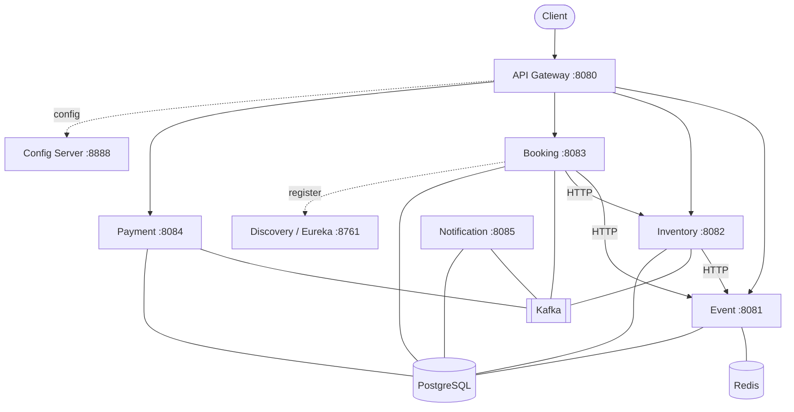

# Live Event Ticketing

A backend platform for selling seats to live events, built as a set of Spring Boot microservices that talk to each other over HTTP and Apache Kafka. It covers the full booking lifecycle: browsing events, holding seats, taking payment, and confirming or cancelling a booking through an event-driven saga.

The project was built as a capstone with a focus on backend architecture, service decomposition, and DevOps (containerization, continuous integration, and image publishing).

## Table of contents

- [Overview](#overview)
- [Architecture](#architecture)
- [Services](#services)
- [Technology stack](#technology-stack)
- [Repository layout](#repository-layout)
- [Prerequisites](#prerequisites)
- [Quick start with Docker](#quick-start-with-docker)
- [Running locally without Docker](#running-locally-without-docker)
- [Configuration](#configuration)
- [Service ports](#service-ports)
- [Authentication](#authentication)
- [Kafka topics and event flow](#kafka-topics-and-event-flow)
- [Booking saga](#booking-saga)
- [Database](#database)
- [Continuous integration and images](#continuous-integration-and-images)
- [Testing](#testing)
- [Troubleshooting](#troubleshooting)
- [Roadmap](#roadmap)

## Overview

The system is split into three platform services and five business services. Each business service owns its own PostgreSQL database and never reads another service's tables. When a service needs data that belongs to another service, it either calls that service over HTTP (when it needs an answer right away) or reacts to a Kafka event (when it only needs to know that something happened).

Authentication happens once, at the API gateway. The gateway validates the JWT, checks the route against role rules, and forwards trusted identity headers to the service behind it. The business services carry no security code of their own and are not exposed publicly.

## Architecture



Solid arrows from the gateway are the only public entry point. Arrows labelled HTTP are synchronous calls where the caller waits for a reply. Lines to Kafka are asynchronous events. Every business service keeps its own slice of PostgreSQL.

## Services

| Service | Port | Type | Responsibility | Storage |
| --- | --- | --- | --- | --- |
| Config Server | 8888 | Platform | Serves configuration for every service from `config-repo` | None |
| Discovery (Eureka) | 8761 | Platform | Service registry so services find each other by name | None |
| API Gateway | 8080 | Platform | Single entry point, JWT authentication, routing | None |
| Event | 8081 | Business | Event catalog and pricing | PostgreSQL + Redis |
| Inventory | 8082 | Business | Seat inventory: hold, confirm, release | PostgreSQL |
| Booking | 8083 | Business | Drives the booking workflow | PostgreSQL |
| Payment | 8084 | Business | Approves or declines payment | PostgreSQL |
| Notification | 8085 | Business | Turns events into user-facing messages | PostgreSQL |

The gateway runs on Spring WebFlux because a gateway spends most of its time waiting on downstream calls, and the reactive stack handles many concurrent connections on a small number of threads. The five business services run on Spring MVC, which is simpler and a good fit for their database-backed work.

## Technology stack

- Java 21
- Spring Boot 4 and Spring Cloud (Gateway, Config, Netflix Eureka, LoadBalancer)
- Apache Kafka for asynchronous messaging
- PostgreSQL with Flyway for schema migrations
- Redis for caching in the Event service
- MapStruct for entity and DTO mapping
- Maven as the build tool
- Docker and Docker Compose for local orchestration
- GitHub Actions for CI and image publishing

## Repository layout

```
.
├── api-gateway/         Reactive gateway: authentication, routing
├── config-server/       Centralized configuration (serves config-repo)
├── discovery-server/    Eureka service registry
├── event/               Event catalog service
├── inventory/           Seat inventory service
├── booking/             Booking workflow service
├── payment/             Payment service
├── notification/        Notification service
├── scripts/             End-to-end and demo scripts
├── docker-compose.yml   Full stack: infrastructure and all services
└── DOCKER.md            Docker usage notes
```

Each business service follows the same internal layout:

```
controller/    REST endpoints
service/       business logic
repository/    Spring Data JPA repositories
entity/        JPA entities
dto/           request and response types for this service's own API
mapper/        MapStruct mappers between entities and DTOs
client/        WebClient callers to other services
client/dto/    local views of other services' responses
messaging/     Kafka publishers and listeners
messaging/event/  event record types
config/        configuration beans (Kafka, WebClient)
exception/     custom exceptions and error handling
```

## Prerequisites

- Docker Desktop with Docker Compose v2.23 or newer, for running the full stack.
- JDK 21 and Maven 3.9 or newer, only needed if you build or run services outside Docker.

## Quick start with Docker

The stack is self-contained. A fresh machine needs only `docker-compose.yml` and the images published to Docker Hub.

```bash
# download the published images
docker compose pull

# start the whole stack in the background
docker compose up -d

# follow logs for a single service
docker compose logs -f booking-service

# stop everything
docker compose down
```

To build the images locally instead of pulling them:

```bash
docker compose build
docker compose up -d
```

The image names default to the `shery2k3` Docker Hub namespace. To use a different registry, set the `REGISTRY` variable before building or pushing:

```bash
REGISTRY=your-dockerhub-user docker compose build
REGISTRY=your-dockerhub-user docker compose push
```

Once the stack is up, the gateway is available at `http://localhost:8080`, the Eureka dashboard at `http://localhost:8761`, and a Kafka UI at `http://localhost:8090`.

## Running locally without Docker

Start the backing infrastructure (PostgreSQL, Redis, Kafka) first. You can run only those from Compose if you prefer:

```bash
docker compose up -d postgres redis kafka
```

Then start the services in this order, each from its own module directory:

1. `config-server`
2. `discovery-server`
3. `api-gateway`
4. the business services: `event`, `inventory`, `booking`, `payment`, `notification`

```bash
cd config-server
mvn spring-boot:run
```

Outside Docker, each service reads its configuration from the config server at `localhost:8888` and registers with Eureka at `localhost:8761`. Those localhost values live in `config-repo` and are used as-is for local runs.

## Configuration

Configuration is centralized in `config-server/src/main/resources/config-repo`. Every service loads its own file on startup through `spring.config.import`. When more than one source defines the same value, Spring resolves it in this order, highest priority first:

1. Environment variables
2. Config server values (`config-repo/*.yaml`)
3. The service's local `application.yaml`

The `config-repo` files use `localhost` for every endpoint so a service can run directly on a developer machine. Inside Docker, `docker-compose.yml` sets environment variables that override those endpoints with Compose service names, because `localhost` inside a container refers to the container itself. The table below shows the overrides.

| Config key | Local value | Environment variable | Docker value |
| --- | --- | --- | --- |
| `spring.config.import` | `...localhost:8888` | `SPRING_CONFIG_IMPORT` | `...config-server:8888` |
| Eureka default zone | `...localhost:8761` | `EUREKA_CLIENT_SERVICEURL_DEFAULTZONE` | `...discovery-server:8761` |
| `spring.datasource.url` | `...localhost:5432/...` | `SPRING_DATASOURCE_URL` | `...postgres:5432/...` |
| `spring.kafka.bootstrap-servers` | `localhost:9092` | `SPRING_KAFKA_BOOTSTRAP_SERVERS` | `kafka:19092` |
| `spring.data.redis.host` (Event only) | `localhost` | `SPRING_DATA_REDIS_HOST` | `redis` |

To see which values a given service overrides in Docker, read that service's `environment:` block in `docker-compose.yml`. Anything not listed there falls through to the config server value.

## Service ports

| Component | Port |
| --- | --- |
| API Gateway | 8080 |
| Config Server | 8888 |
| Discovery (Eureka) | 8761 |
| Event | 8081 |
| Inventory | 8082 |
| Booking | 8083 |
| Payment | 8084 |
| Notification | 8085 |
| Kafka (host) | 9092 |
| Kafka UI | 8090 |
| Redis | 6379 |
| PostgreSQL (host) | 5433 |

PostgreSQL is published on host port 5433 to avoid clashing with a PostgreSQL instance that may already run on the default 5432. Inside the Compose network the services still reach it on 5432.

## Authentication

Log in at `POST /api/auth/login` with a username and password to receive a JWT signed with HS256. Send it on later requests as an `Authorization: Bearer <token>` header. The gateway validates the signature and expiry, maps the `roles` claim to Spring authorities, and forwards `X-User-Id` and `X-User-Roles` to the downstream service.

Demo accounts:

| Username | Password | Role |
| --- | --- | --- |
| admin | admin123 | ADMIN |
| user | user123 | USER |

Route rules:

- Public: `POST /api/auth/login`, `GET /api/events/**`, `GET /api/inventory/**`, `/actuator/health`, `/actuator/info`.
- ADMIN only: creating, updating, and deleting events and inventory.
- Authenticated: `/api/bookings/**` and `/api/payments/**`.

## Kafka topics and event flow

| Topic | Produced by | Consumed by |
| --- | --- | --- |
| `seat-reserved` | Booking | Payment, Notification |
| `payment-completed` | Payment | Booking, Inventory, Notification |
| `payment-failed` | Payment | Booking, Inventory, Notification |
| `booking-confirmed` | Booking | Notification |

Events are published with the booking reference as the message key, so all events for the same booking land in one partition and are processed in order. Topics are created with three partitions. Notification belongs to a single consumer group and listens to all four topics.

## Booking saga

A booking spans three services with three separate databases, so it cannot run inside a single database transaction. Instead it is a choreographed saga: each service performs its own local step and reacts to events from the others. A failure is undone by a compensating action rather than a rollback.

Happy path:

1. Booking validates the event and price by calling Event over HTTP.
2. Booking holds the seats by calling Inventory over HTTP. A conflict returns 409 and stops the booking immediately.
3. Booking saves the booking as `PENDING_PAYMENT` and publishes `seat-reserved`.
4. Payment consumes `seat-reserved`, decides the outcome, and publishes `payment-completed`.
5. Booking marks the booking `CONFIRMED` and publishes `booking-confirmed`. Inventory confirms the held seats.
6. Notification records messages along the way.

Failure path:

1. Payment publishes `payment-failed`.
2. Booking marks the booking `CANCELLED` with a reason.
3. Inventory releases the held seats so they become available again.

Consumers are idempotent. Booking guards on state (it ignores an event if the booking is no longer `PENDING_PAYMENT`) and Notification uses a unique constraint on the event type and booking reference. This makes reprocessing a duplicate delivery a no-op, which matters because Kafka guarantees at-least-once delivery.

## Database

Each business service owns its own PostgreSQL database:

- `ticketing_event`
- `ticketing_inventory`
- `ticketing_booking`
- `ticketing_payment`
- `ticketing_notification`

Flyway manages each schema and applies migrations on first startup. The five databases are created automatically on first run through an init script that is embedded directly in `docker-compose.yml` as a Compose config and mounted into the PostgreSQL init directory. A fresh volume therefore needs no extra setup files.

## Continuous integration and images

Two GitHub Actions workflows live in `.github/workflows`:

- `build.yml` builds and tests all eight modules on pushes and pull requests.
- `docker-publish.yml` runs on every push to `main`. It builds each service image and pushes it to Docker Hub tagged `latest`.

Published images follow the pattern `shery2k3/ticketing-<service>`, for example `shery2k3/ticketing-booking-service`. Publishing requires two repository secrets: `DOCKERHUB_USERNAME` and `DOCKERHUB_TOKEN`.

Because the compose file pins the `latest` tag, `docker compose pull` always fetches the most recent build from `main`.

## Testing

- Unit and slice tests run with `mvn test` in each module.
- `scripts/e2e.mjs` runs an end-to-end check against a running stack, including login and a full booking.

## Troubleshooting

- A service fails to start before its database or broker is ready. Compose uses health checks and `depends_on` conditions to start services in order. Give the stack a moment on first boot while PostgreSQL and Kafka become healthy.
- Port 5432 is already in use. The stack publishes PostgreSQL on host port 5433 to avoid this. Connect external tools to 5433.
- Connecting to Kafka from the host uses `localhost:9092`. Services inside the Compose network use `kafka:19092`.
- Configuration values look wrong in Docker. Check the service's `environment:` block in `docker-compose.yml`, since environment variables override config server values.
